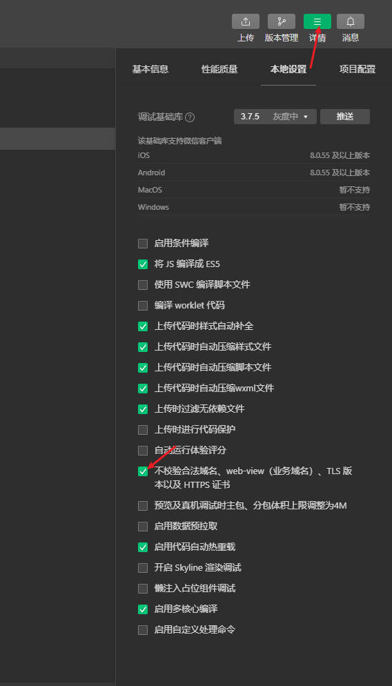

# Swagger

## 介绍

* 使用Swagger，你只需要按照他的规范去定义接口以及接口相关的信息，就可以做到**生成接口文档，以及在线接口调试页面。**
* 官网：http://swagger.io/
* Knife4j是为Java MVC框架集成Swagger生成Api文档的增强解决方案。

```xml
<dependency>
    <groupId>com.github.xiaoymin</groupId>
    <artifactId>knife4j-spring-boot-starter</artifactId>
    <version>3.0.2</version>
</dependency>
```

## 使用方式

1. 导入Knife4j的maven坐标

2. 在配置类中加入knife4j相关配置

3. 设置静态资源映射，否则接口文档页面无法访问

   * 配置静态资源方法一：创建Java配置类实现WebMvcConfigurer接口

     ```java
     @Configuration
     public class WebConfig implements WebMvcConfigurer {
     
         /**
          * 设置静态资源映射
          * @param registry
          */
         protected void addResourceHandlers(ResourceHandlerRegistry registry) {
             log.info("开始设置静态资源映射");
             registry.addResourceHandler("/doc.html").addResourceLocations("classpath:/META-INF/resources/");
             registry.addResourceHandler("/webjars/**").addResourceLocations("classpath:/META-INF/resources/webjars/");
         }
     }
     ```

   * 配置静态资源方法二：在配置文件中设置静态资源映射

     ```properties
     spring.resources.static-locations=classpath:/META-INF/resources/,classpath:/resources/,classpath:/static/,classpath:/public/
     ```

   * 如果没有配置静态资源映射，Spring Boot会自动从以下classpath路径下查找静态资源：

     ```
     classpath:/META-INF/resources/
     classpath:/resources/
     classpath:/static/
     classpath:/public/
     ```

4. 在WebMvcConfiguration配置类中添加配置项：

   ```java
   /**
    * 通过knife4j生成接口文档
    * @return
    */
   @Bean
   public Docket docket() {
       log.info("准备生成接口文档");
       ApiInfo apiInfo = new ApiInfoBuilder()
               .title("苍穹外卖项目接口文档") //标题
               .version("2.0") // 版本
               .description("苍穹外卖项目接口文档") //描述信息
               .build();
       Docket docket = new Docket(DocumentationType.SWAGGER_2) // Swagger版本
               .apiInfo(apiInfo)
               .select()
   	        // 指定生成接口需要扫描的包（以及子包）
               .apis(RequestHandlerSelectors.basePackage("com.sky.controller"))
               .paths(PathSelectors.any())
               .build();
       return docket;
   }
   ```

## 常用注解

* 通过注解可以控制生成的接口文档，使接口文档拥有更好的可读性，常用注解如下：

  | 注解                        | 说明                                                   |
  | --------------------------- | ------------------------------------------------------ |
  | @Api(tags = "")             | 用在类上，例如Controller，表示对类的说明               |
  | @ApiModel(description = "") | 用在类上，例如entity、DTO、VO                          |
  | @ApiModelProperty("")       | 用在属性上，描述属性信息                               |
  | @ApiOperation("")           | 用在方法上，例如Controller的方法，说明方法的用途、作用 |


# MD5加密算法

## 简介

* MD5（Message Digest Algorithm 5）是一种广泛使用的密码散列函数，由MIT的计算机科学家Ronald Rivest设计，并于1992年发布。MD5的主要用途是生成一个128位（16字节）的哈希值**（通常表示为32位的十六进制数）**，用于确保数据完整性。尽管MD5在早期被广泛应用于各种安全场景，但由于其存在一些已知的安全漏洞，目前不再推荐用于需要高强度安全性的场合。

## 工作原理

MD5的基本思想是将任意长度的消息压缩成一个固定长度（128位）的哈希值。具体过程可以分为以下几个步骤：

1. **填充消息**：首先对输入消息进行填充，使得其长度对512取模后余数为448（即总长度为512*n + 448）。填充规则是在消息后面添加一个1位和若干个0位，直到满足条件为止。最后再附加一个64位的长度字段，表示原始消息的长度（以比特为单位）。
2. **初始化缓冲区**：MD5使用四个32位寄存器（A, B, C, D），它们的初始值分别为：
   * A: `0x67452301`
   * B: `0xEFCDAB89`
   * C: `0x98BADCFE`
   * D: `0x10325476`
3. **分块处理**：将填充后的消息分成512位的块，每个块进一步分成16个32位子块。对于每个512位块，依次执行以下操作：
   - 将当前块的16个32位子块扩展为64个32位子块。
   - 使用非线性函数（F、G、H、I）和循环移位等操作更新缓冲区的四个寄存器（A, B, C, D）。
4. 输出结果：经过所有块的处理后，缓冲区中的四个寄存器（A, B, C, D）按顺序拼接起来形成最终的128位哈希值。

## MD5的特点

- **确定性**：相同的输入总是产生相同的输出。
- **快速计算**：MD5的设计使其能够快速计算出哈希值。
- **抗碰撞性弱**：由于存在已知的碰撞攻击方法，MD5无法有效防止不同的输入产生相同的哈希值。
- **不可逆性**：从哈希值反推出原始输入几乎是不可能的（除非使用暴力破解或彩虹表）。

## MD5的应用场景

尽管MD5存在安全问题，但在某些特定场景下仍然有用：

1. **校验文件完整性**：通过比较下载文件的MD5哈希值与官方提供的哈希值，可以检测文件是否在传输过程中损坏或被篡改。
2. **数字签名**：虽然不建议单独使用MD5进行数字签名，但有时会与其他更安全的算法结合使用。
3. **存储密码**：早期曾用于存储用户密码的哈希值，但现在不推荐这样做，因为MD5容易受到彩虹表攻击和暴力破解。

## 安全性问题

MD5的安全性问题主要体现在以下几个方面：

- **碰撞攻击**：研究人员已经找到了构造不同消息具有相同MD5哈希值的方法。这意味着MD5不能保证唯一性，容易被利用进行伪造攻击。
- **预映射攻击**：通过预先计算大量可能的输入及其对应的哈希值（如彩虹表），可以在较短时间内找到给定哈希值的原像。
- **长度扩展攻击**：在不知道原始消息的情况下，可以通过已知的哈希值和消息长度来计算附加内容后的哈希值

## 使用

```java
import org.springframework.util.DigestUtils;

String password = "123456";
// 方法传入一个byte类型数组，返回一个字符串。
password = DigestUtils.md5DigestAsHex(password.getBytes());
```


# 公共字段自动填充

我们在对数据库表的某条记录进行操作时，往往该条记录会包含创建人、创建时间、更新人、更新时间等公共字段。其中创建人和创建时间对应着插入操作，更新人和更新时间对应着修改操作。我们可以**自定义一个注解，在需要进行公共字段填充的方法上使用该注解，并利用AOP切面编程，在标有该注解的方法执行之前进行拦截，利用反射机制为公共字段自动填充数据。可以在注解中添加属性（该属性可以是枚举），来标明具体是哪种类型的操作，从而确认要填充哪些字段。**

## 自定义枚举

自定义枚举类型来表示具体的数据库操作类型

```java
public enum OperationType {

    /**
     * 更新操作
     */
    UPDATE,

    /**
     * 插入操作
     */
    INSERT

}
```

## 自定义注解

自定义注解，用于标识某个方法需要进行公共字段自动填充。

```java
@Target(ElementType.METHOD) // 可以出现在方法上
@Retention(RetentionPolicy.RUNTIME) // 可以被反射机制所读取
public @interface AutoFill {
    // 数据库操作类型：update，insert
    OperationType value();
}
```

自定义切面

```java
@Aspect // 切面类
@Slf4j
@Component // 切面类和目标类都需要纳入spring容器管理
public class AutoFillAspect {
    /**
     * 切入点
     */
    @Pointcut("execution(* com.sky.mapper.*.*(..)) && @annotation(com.sky.annotation.AutoFill)")
    public void autoFillPointCut(){}

    /**
     * 前置通知
     */
    @Before("autoFillPointCut()")
    public void autoFill(JoinPoint joinPoint){
        log.info("开始进行公共字段自动填充");
        // 1. 获取当前被拦截的方法上的数据库操作类型
        MethodSignature signature = (MethodSignature) joinPoint.getSignature();
        AutoFill autoFill = signature.getMethod().getAnnotation(AutoFill.class);
        OperationType type = autoFill.value();
        // 2. 获取当前被拦截的方法的参数(要自动赋值的那个实体对象)
        Object[] args = joinPoint.getArgs();
        if(args == null || args.length == 0){
            return;
        }
        Object entity = args[0];
        // 3. 准备公共属性值
        LocalDateTime now = LocalDateTime.now();
        Long id = BaseContext.getCurrentId();
        // 4. 根据不同的操作类型，为属性来赋值
        if (type == OperationType.INSERT){
            try {
                Method setCreateTime = entity.getClass().getDeclaredMethod(AutoFillConstant.SET_CREATE_TIME, LocalDateTime.class);
                Method setCreateUser = entity.getClass().getDeclaredMethod(AutoFillConstant.SET_CREATE_USER, Long.class);
                Method setUpdateTime = entity.getClass().getDeclaredMethod(AutoFillConstant.SET_UPDATE_TIME, LocalDateTime.class);
                Method setUpdateUser = entity.getClass().getDeclaredMethod(AutoFillConstant.SET_UPDATE_USER, Long.class);
                setCreateTime.invoke(entity, now);
                setCreateUser.invoke(entity, id);
                setUpdateTime.invoke(entity, now);
                setUpdateUser.invoke(entity, id);
            } catch (Exception e) {
                e.printStackTrace();
            }
        } else if (type == OperationType.UPDATE) {
            try {
                Method setUpdateTime = entity.getClass().getDeclaredMethod(AutoFillConstant.SET_UPDATE_TIME, LocalDateTime.class);
                Method setUpdateUser = entity.getClass().getDeclaredMethod(AutoFillConstant.SET_UPDATE_USER, Long.class);
                setUpdateTime.invoke(entity, now);
                setUpdateUser.invoke(entity, id);
            } catch (Exception e) {
                e.printStackTrace();
            }
        }
    }
}
```


# HttpClient

## 介绍

* HttpClient是Apache Jakarta Common下的子项目，可以用来提供高效的、最新的、功能丰富的支持HTTP协议的客户端编程工具包，并且它支持HTTP协议最新的版本和建议。

* 我们可以在Java程序当中通过HttpClient工具包构造和发送HTTP请求。

* Maven坐标

  ```xml
  <!-- https://mvnrepository.com/artifact/org.apache.httpcomponents/httpclient -->
  <dependency>
      <groupId>org.apache.httpcomponents</groupId>
      <artifactId>httpclient</artifactId>
      <version>4.5.13</version>
  </dependency>
  ```

* 核心API

  ```
  HttpClient 发送HTTP请求，是一个接口
  HttpClients 创建HttpClient对象
  CloseableHttpClient 具体的实现类，实现了HttpClient接口
  HttpGet 代表Get方式的请求
  HttpPost 代表Post方式的请求
  ```

## 发送请求步骤

1. 创建HttpClient对象
2. 创建Http请求对象
   * 发送Get请求就需要构造HttpGet对象
   * 发送Post请求就需要构造HttpPost对象
3. 调用HttpClient的execute方法发送请求

## 案例

```java
@SpringBootTest
public class HttpClientTest {
    /**
     * 测试通过httpClient发送Get方式的请求
     */
    @Test
    public void testGet() throws IOException {
        // 1. 创建httpclient对象
        CloseableHttpClient httpClient = HttpClients.createDefault();
        // 2.创建请求对象
        HttpGet httpGet = new HttpGet("http://111.119.211.126:80/user/shop/status");
        // 3.发送请求,并接受响应结果
        CloseableHttpResponse response = httpClient.execute(httpGet);
        // 4.获取服务器返回的状态码
        int statusCode = response.getStatusLine().getStatusCode();
        System.out.println("状态码：" + statusCode);
        // 5.获取响应体
        HttpEntity entity = response.getEntity();
        // 6.将响应体解析为字符串格式
        String body = EntityUtils.toString(entity);
        System.out.println("服务器响应的数据：" + body);
        // 7.关闭资源
        response.close();
        httpClient.close();
    }

    /**
     * 通过httpClient发送Post方式的请求
     */
    @Test
    public void testPOST() throws IOException {
        // 1.创建httpclient对象
        CloseableHttpClient httpClient = HttpClients.createDefault();
        // 2.创建请求对象
        // 这里登录功能是一个Post请求，并且需要提交Json格式的请求参数，
        HttpPost httpPost = new HttpPost("http://111.119.211.126:80/admin/employee/login");
        // 构造请求参数
        // new StringEntity()需要传入一个Json格式的字符串
        JSONObject jsonObject = new JSONObject();
        jsonObject.put("username", "admin");
        jsonObject.put("password", "123456");
        StringEntity entity = new StringEntity(jsonObject.toString());
        // 指定请求编码方式和数据格式
        entity.setContentEncoding("utf-8");
        entity.setContentType("application/json");
        // 设置请求参数
        httpPost.setEntity(entity);
        // 3.发送请求
        CloseableHttpResponse response = httpClient.execute(httpPost);
        // 4.解析返回结果
        int statusCode = response.getStatusLine().getStatusCode(); // 获取响应码
        System.out.println("响应码：" + statusCode);
        HttpEntity responseEntity = response.getEntity(); // 获取响应体
        String body = EntityUtils.toString(responseEntity); // 解析响应体
        System.out.println("响应体：" + body);
        // 5.关闭资源
        response.close();
        httpClient.close();
    }
}
```


# 微信小程序

## 介绍

* 注册范围（以不同的身份注册小程序，不同的主体注册的小程序权限不同）
  * 个人
  * 企业
  * 政府
  * 媒体
  * 其他组织

* 开发支持：微信官方提供了一系列工具帮助开发者快速接入并完成小程序开发
  * 开发文档
  * 开发者工具
  * 设计指南
  * 小程序体验Demo
* 接入流程
  1. 注册：在微信公众平台注册小程序，完成注册后可以同步进行信息完善和开发
  2. 小程序信息完善：填写小程序基本信息，包括名称、头像、介绍及服务范围等。
  3. 开发小程序：完成小程序开发者绑定，开发信息配置后，开发者可下载开发者工具，参考开发文档进行小程序的开发和调试。
  4. 提交审核和发布：完成小程序开发后，提交代码至微信团队审核，审核通过后即可发布（公测期间不能发布）

## 准备工作

* 开发微信小程序之前需要做如下准备工作：
  1. 注册小程序
  2. 完善小程序信息
  3. 下载开发者工具

### 注册小程序

* 注册地址：https://mp.weixin.qq.com/wxopen/waregister?action=step1

### 完善小程序信息

* 小程序信息
* 小程序类目
* 获取AppID：开发与服务->开发管理->开发设置 
* 生成小程序秘钥：开发与服务->开发管理->开发设置

### 下载开发者工具

* 下载地址：https://developers.weixin.qq.com/miniprogram/dev/devtools/stable.html

* 使用微信扫码登录

* 点击加号创建小程序

  

* 勾选不校验合法域名

  

## 入门案例

* 操作步骤
  * 了解小程序目录结构
  * 编写小程序代码
  * 编译小程序

### 小程序目录结构

* 小程序包含一个描述整体程序的app和多个描述各自页面的page。一个小程序主体部分由三个文件组成，必须放在项目的根目录，如下：

  

* 小程序页面放在pages目录下，每个小程序页面由四个文件组成，如下：

  

### 文件介绍

* app.json文件（公共配置文件）

  

* app.wxss(公共样式)

  相当于css样式

### 开发案例

* index.wxml

  ```html
  <!--index.wxml-->
  <!-- navigation-bar用于设置导航栏信息 -->
  <navigation-bar title="苍穹外卖" back="{{false}}" color="black" background="#FFF"></navigation-bar>
  <scroll-view class="scrollarea" scroll-y type="list">
    <view class="container">
      <!-- view标签相当于div标签 -->
      <view>
        <!-- {{}}类似于vue的插值语法，这里的变量msg是动态的，需要在index.js文件中定义 -->
        {{msg}}
      </view>
  
      <view>
        <!-- 
          定义一个按钮，type共有三种类型：primary、default、warn
          通过bindtap="函数名"绑定事件，
        -->
        <button bindtap="getUserInfo" type="primary">获取用户信息</button>
        昵称：{{nikeName}}
        <image style="width: 100px; height: 100px;" src="{{url}}"></image>
      </view>
    </view>
  </scroll-view>
  ```

* index.js

  ```js
  // index.js
  Page({
    // 定义当前需要使用的数据 json格式
    data: {
      msg: 'hello world',
      nikeName:'',
      url:'',
    },
  
    //定义方法，获取微信用户的头像和昵称
    getUserInfo(){
      // wx是内置的一个对象，通过调用其getUserProfile方法获取微信用户信息
      wx.getUserProfile({
        desc: '获取用户信息',
        // 获取成功后执行回调函数
        success: (res) =>{
          console.log(res.userInfo)// 打印用户信息
          // 为数据赋值
          this.setData({
            nikeName: res.userInfo.nickName,
            url:res.userInfo.avatarUrl
          })
        }
      })
    }
  })
  ```

  

